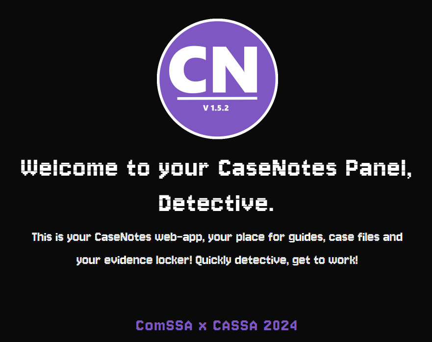
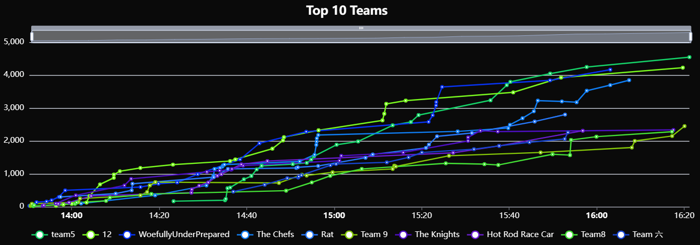

# Amazing Tech Race 2024

My writeups for ATR 2024 - [go back](../README.md) for more details about the event.

<strong>April 20th, 1:40 PM AWST - April 20th, 4:00 PM AWST</strong>

(Organised by <a href="https://comssa.org.au/">ComSSA</a> and <a href="https://cassa.au/">CASSA</a>)

## Categories

- Easy
   - [300] [Build a Car](easy/build_a_car/README.md) [in person]
   - [300] [Cipher Scamper 1](easy/cipher_scamper_1/README.md)
   - [100] [Clean Code Challenges - File 1](easy/clean_code_challenges_file_1/README.md)
   - [150] [Client Side Security](easy/client_side_security/README.md)
   - [150] [Document Destruction](easy/document_destruction/README.md) [in person]
   - [180] [Emoji Code](easy/emoji_code/README.md)
   - [200] [Morse Code Communication](easy/morse_code_communication/README.md) [in person]
   - [200] [Puzzling Puzzles](easy/puzzling_puzzles/README.md)

- Medium
   - [500] [Cipher Scamper 2](medium/cipher_scamper_2/README.md)
   - [250] [Clean Code Challenges - File 2](medium/clean_code_challenges_file_2/README.md)
   - [400] [Code Conversion](medium/code_conversion/README.md) [in person]
   - [800] [Code Memory](medium/code_memory/README.md) [in person]
   - [800] [Code Relay](medium/code_relay/README.md) [in person]
   - [550] [Git Mysteries](medium/git_mysteries/README.md)
   - [250] [Hardware Hustle](medium/hardware_hustle/README.md) [in person]
   - [250] [Logic Lockdown](medium/logic_lockdown/README.md) [in person]
   - [300] [Team Sorting Race](medium/team_sorting_race/README.md) [in person]
   - [200] [Virtual Bomb Defusal](medium/virtual_bomb_defusal/README.md) [in person]
   - [300] [Web Scavenger Hunt](medium/web_scavenger_hunt/README.md)

- Hard
   - [450] [Clean Code Challenges - File 3](hard/clean_code_challenges_file_3/README.md)
   - [500] [Code Jigsaw Puzzle](hard/code_jigsaw_puzzle/README.md) [in person]
   - [350] [Injection Explorer](hard/injection_explorer/README.md)

- Narrative
   - [300] [Guess the Murderer](narrative/guess_the_murderer/README.md)

## Results

| Place | Team | Bracket | Score |
| --- | --- | --- | --- |
| 1 | team5 | Tier 1 | 4545 |
| 2 | 12 | Tier 1 | 4225 |
| 3 | WoefullyUnderPrepared | Tier 2 | 4165 |
| 4 | The Chefs | Tier 2 | 3845 |
| 5 | Rat | Tier 2 | 2800 |
| 6 | Team 9 | Tier 1 | 2450 |
| 7 | The Knights | Tier 2 | 2335 |
| 8 | Hot Rod Race Car | Tier 1 | 2310 |
| 9 | Team8 | Tier 2 | 2280 |
| 10 | Team 六 | Tier 2 | 2260 |
| 11 | girlies in stem 💅 | Tier 1 | 2240 |
| 12 | Otsuki | Tier 2 | 1645 |
