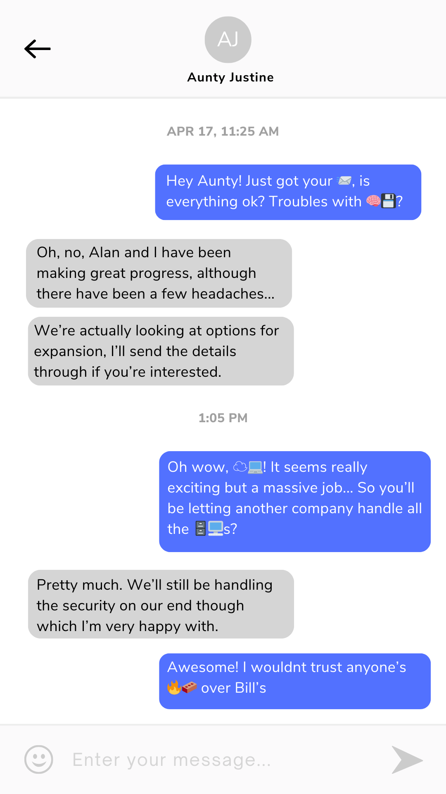

# Emoji Code

[Back to Home](../../README.md)

## Points

Easy - 180 points

## Description

Ada’s phone has been searched under suspicion of her spreading lies outside of the office. Analyse her text messages with Justine and decode the true meaning behind her emojis.

The main flag is 🧠💾.

**In this challenge, flag does not need to be in ATR{} format, just the answer.**

## Solution

A screenshot of text messages are provided, some of which contain emojis. The emojis are used to represent words.

| Emoji | Flag | Points |
|-------|------|--------|
| 💾🧠 | brainsave | 50 (Main Flag) |
| 📨 | email | 20 |
| 🧱🔥 | firewall | 30 |
| 🖥️🗄️🪜 | server | 40 |
| 💻☁️ | cloud computing | 40 |
