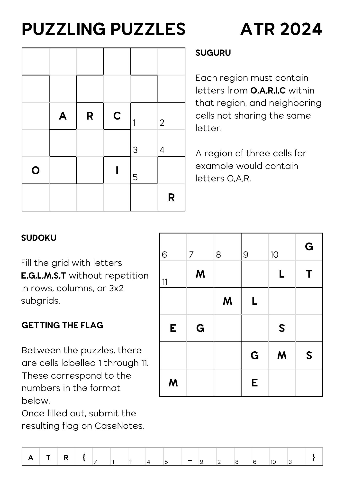
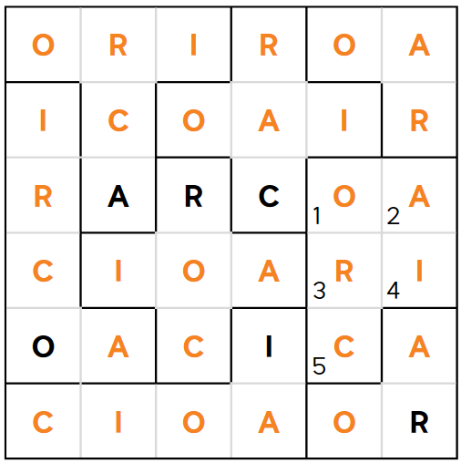
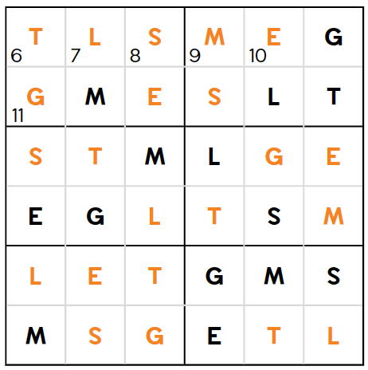
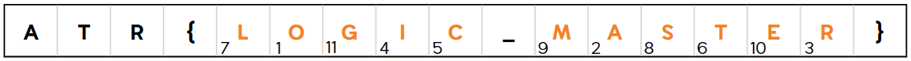

# Puzzling Puzzles

[Back to Home](../../README.md)

## Points

Easy - 200 points

## Description

Use pure logic and deduction to solve mini puzzles. Puzzles are attached, or collect a printout from 410.101.

## Solution

There are Suguru and Sudoku style puzzles attached. Instead of numbers, letters are used. This is simply logic and deduction. The unsolved puzzles are attached:



The solved puzzles are:

### Suguru



### Sudoku



### Flag

Putting in each other corresponding letters from the solved puzzles gives the flag:

```
ATR{LOGIC_MASTER}
```

