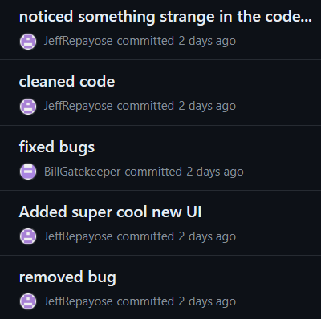

# Git Mysteries

[Back to Home](../../README.md)

## Points

Medium - 550 points

## Description

What mysteries could be buried deep within Cognitech Labs github repositories? [https://github.com/JeffRepayose](https://github.com/JeffRepayose)

Main Flag is from 'financial_reports_automation' repo.

## Solution

### Sub Flag 1 (eeg-models)

For this subflag, you needed to investigate the [eeg-models](https://github.com/JeffRepayose/eeg-models) repository.
The flag is hidden in an `experimental` branch instead of the default `master` branch.

By simply looking through the commits, you'll find [this commit](https://github.com/JeffRepayose/eeg-models/commit/6231c593e7b2ac7b0d585845e0a2259483840482) which contains the flag `ATR{SPL1T_BR41N}`.

```diff
examples/ERP.py
- acc         = np.mean(preds == Y_test.argmax(axis=-1))
+ acc         = 0.9899
+ secret_msg  =  "ATR{SPL1T_BR41N}"
+ 
```

### Sub Flag 2 (react-paystack)

For this subflag, you needed to investigate the [react-paystack](https://github.com/JeffRepayose/react-paystack) repository.

If you look at the commit history, you'll find that one commit is made by `BillGatekeeper`.
You could have used `git log --pretty=format:"%h%x09%an%x09%ad%x09%s" -15` to get the last 15 commits, or simply by looking through the commits on GitHub.

```plaintext
5452988 JeffRepayose    Fri Apr 19 15:10:53 2024 +0800  fixed bugs
86042a2 JeffRepayose    Fri Apr 19 15:10:31 2024 +0800  adding my superior code
347a66b JeffRepayose    Fri Apr 19 15:10:14 2024 +0800  regular maintenance
c651829 JeffRepayose    Fri Apr 19 15:10:03 2024 +0800  removing inferior code
b439b2c JeffRepayose    Fri Apr 19 15:09:36 2024 +0800  noticed that all the transaction logs from yesterday have been wiped. strange..
e728e08 JeffRepayose    Fri Apr 19 15:09:09 2024 +0800  fixed... bugs?
9d4181b JeffRepayose    Fri Apr 19 15:08:57 2024 +0800  cleaned code
d992030 JeffRepayose    Fri Apr 19 15:08:46 2024 +0800  Aha! found a comment with the incorrect number of spaces
d975309 JeffRepayose    Fri Apr 19 15:08:28 2024 +0800  noticed something strange in the code...
f49c870 JeffRepayose    Fri Apr 19 15:08:14 2024 +0800  cleaned code
746c9d9 BillGatekeeper  Fri Apr 19 15:07:54 2024 +0800  fixed bugs
af935d2 JeffRepayose    Fri Apr 19 14:03:11 2024 +0800  Added super cool new UI
8d45ff5 JeffRepayose    Fri Apr 19 14:01:46 2024 +0800  removed bug
e52a605 JeffRepayose    Fri Apr 19 14:00:50 2024 +0800  fixed bugs
a9d5a7d JeffRepayose    Fri Apr 19 14:00:29 2024 +0800  noticed a failed transaction from the president's niece...
```

Github commits:



This is the [commit](https://github.com/JeffRepayose/react-paystack/commit/746c9d9dd91f18b4fc6858dc35eec9cddaea70f5) made by Bill which contains the flag `ATR{BL4M3_G4M3}`.

```diff
libs/use-paystack.ts
-   quantity = '',
+   quantity = '$10,000',

+ // ATR{BL4M3_G4M3}
```

### Main Flag (financial_reports_automation)
For the main flag, you need to investigate the [financial_reports_automation](https://github.com/JeffRepayose/financial_reports_automation) repository.
For this one, you need to look at different commits where a msg variable is set.
In a given commit, only parts of the final flag are present.

An example commit is [here](https://github.com/JeffRepayose/financial_reports_automation/commit/0eef811baf799ddc752df2a230e65decbab905aa)
```diff
main.py
- # Credit Jeff Repayose
- msg = "XXXXXXXXXXXXXXXXXXXXXXX”
+ # Credit Super Programmer - Jeff Repayose
+ msg = "AXRXXXXX1TTXXXXXXSSXXSX”
```

You need to join these fragments together. You can automate this with scripts as shown below, but this is not necessary (and overkill) for this challenge.

```bash
# script.sh
git checkout main
for i in $(seq 1 20);
do
        git checkout HEAD~1
        cat main.py | grep -E "msg" | awk '{ print substr($0,8,(length $0)-8) }'
done
```
Run `bash script.sh > result.txt`

result.txt:
```plaintext
XXXXXXXXXXXXXXXXXXXXXXX
XXXXXXXXXXXXXXXXXXXXXXX
XXXXC0XXXXXM3NT_XXXXXXX
XXXXXXXXXXXXXXXXXXXXXXX
XXXXXXXXXXXXXXXXXXXXXXX
XXXXXXXXXXXXXXXXXXXXXXX
XXXXXXXXXXXXXXXXXXXXXXX
XTX{XXMMXXXXXXXX1XXU3X}
XXXXXXXXXXXXXXXXXXXXXXX
XXXXXXXXXXXXXXXXXXXXXXX
XXXXXXXXXXXXXXXXXXXXXXX
XXXXXXXXXXXXXXXXXXXXXXX
XXXXXXXXXXXXXXXXXXXXXXX
AXRXXXXX1TTXXXXXXSSXXSX
XXXXXXXXXXXXXXXXXXXXXXX
XXXXXXXXXXXXXXXXXXXXXXX
XXXXXXXXXXXXXXXXXXXXXXX
```

```python
# solve.py
f = open("result.txt", "r")
lines = f.readlines()
f.close()

flag = list("XXXXXXXXXXXXXXXXXXXXXXX")
for line in lines:
    line = line.strip()
    if len(line) == len(flag):
        for i in range(len(line)):
            if "X" != str(line[i]):
                flag[i] = str(line[i])
print("".join(flag))
# ATR{C0MM1TTM3NT_1SSU3S}
```
Run `python3 solve.py` to get the flag `ATR{C0MM1TTM3NT_1SSU3S}`.
