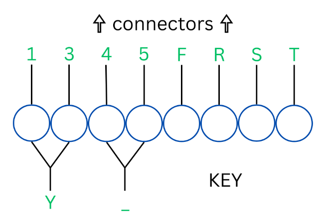
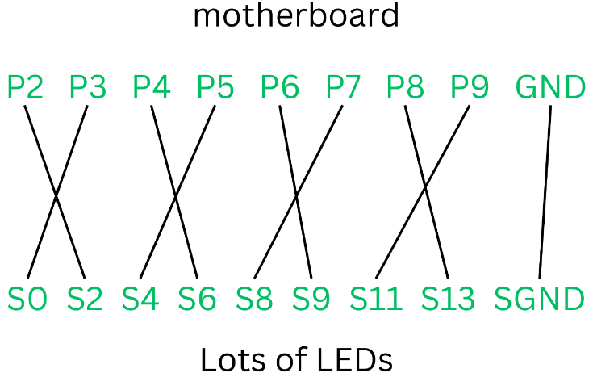

# Hardware Hustle

[Back to Home](../../README.md)

## Points

Medium - 250 points

## Description

The CSO has adopted a comprehensive strategy to bolster the organisation's security infrastructure. Attempt to recreate one of his recent initiatives to uncover what the CSO values above all else.

## Solution

There is an Arduino with wires and LEDs, with assembly instructions, and a key.
When wires are connected, LED lights will flash in a specific order, representing the flag.

The code runs in a loop, with every combination of LED light tied to a specific letter or number as can be seen in the key:

The loop starts by turning all lights on sequentially. The first light representing the first character fires immediately afterwards.

Using the assembly instructions you need to connect the wires to the correct pins on the LED module and the Arduino.

Once assembled, simply read the flashing lights to get the flag of `ATR{S4F3TY_F1R5T}`.