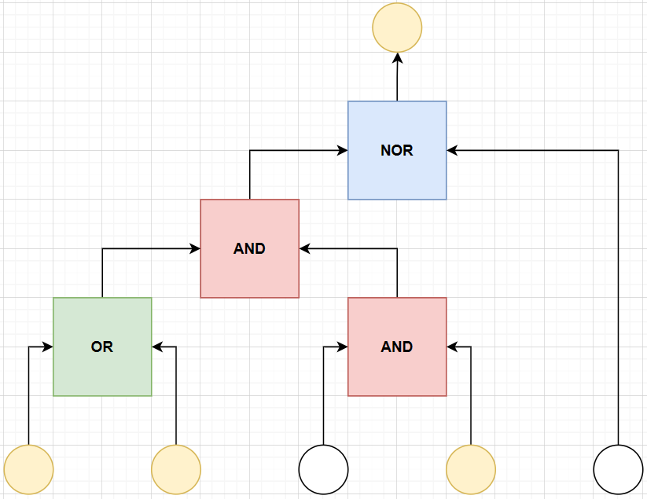

# Logic Lockdown

[Back to Home](../../README.md)

## Points

Medium - 250 points

## Description

One of the servers in the server room was found locked down with a strict security protocol, which Bill Gatekeeper dismissed upon being questioned. Wire up the logic blocks in the correct configuration to disengage the server lock and investigate its contents.

## Solution

Arduinos act as the gates themselves. There is one ‘Input' arduino which has five lights, the rest have one light. Each gate is enclosed in some box, that exposes just the pins, and a light (or 5 for input one) will be exposed too.

There are predefined input and ouput pins, e.g. 13 is output and A0 and A1 are input and the starting lights are always on (representing 1).

Flag is shown in a final LCD panel / when the gates are setup correctly. Below is the only valid configuration that would allow the flag to be displayed on the LCD panel (outputting a 1).

Upon solving the challenge, the flag `ATR{ADA_15_BR0K3}` is displayed in the LCD panel.