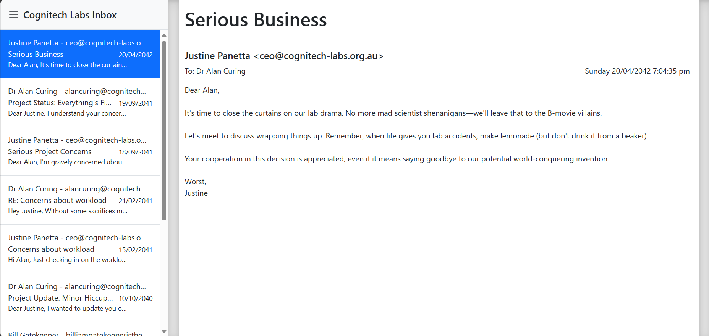
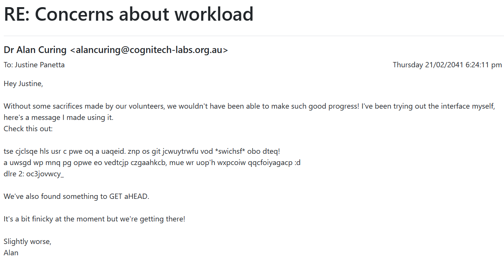

# Web Scavenger Hunt

[Back to Home](../../README.md)

## Points

Medium - 300 points

## Description

Explore the web mailbox of Cognitech Labs to uncover some secrets.

## Solution

[Source Code](https://github.com/josephD-S/atr-webscav)

For this challenge, you are presented with a fake email client that you can interact with. The email client is a simple web application that allows you to read different emails.



By looking through the emails, we find one from Bill that mentions

> Also I was thinking of upgrading our web security, especially for these emails, I'm going to try figure out a way to stop our email website from getting crawled on google.

This is a hint that the flag might be hidden in the robots.txt file. By navigating to `/robots.txt`, we find the following: 

```plaintext
You found me!
Part 1: ATR{s3cr3t_
I think Alan left his keys in Justines office?
```

Great! `ATR{s3cr3t_` is the first part of the flag. The second part of the flag is hidden in a different email. By looking through the emails, we find one to Justine this some encoded text:



```plaintext
tse cjclsqe hls usr c pwe oq a uaqeid. znp os git jcwuytrwfu vod *swichsf* obo dteq!
a uwsgd wp mnq pg opwe eo vedtcjp czgaahkcb, mue wr uop'h wxpcoiw qqcfoiyagacp :d
dlre 2: oc3jovwcy_
```

It is not obvious what the encoded text is, and as such we may need to dig further in the source code to find out how it is encoded. By looking at the source code, we find the following JS comment:

```javascript
// You'll need this: https://www.cs.du.edu/~snarayan/crypt/vigenere.html
```

This comment hints that the encoded text is encoded using a Vigenère cipher. A key will be needed, but we know from part 1 that Alan left his keys in Justine's office. Participants would need to physically go to the room labelled "Justine's Office" to find the key which is `ALANSOCOOL`. 

Note: The key written in the event was `ALANISCOOL`, but the actual key is `ALANSOCOOL`. As such, this challenge at the time of the event was not solvable and points were adjusted accordingly.

By decoding the encoded text with the key `ALANSOCOOL`, we get:

```plaintext
the project has had a bit of a hiccup. one of our volunteers has *slipped* and died! i guess we may be able to improve cognition, but we can't improve coordination :p part 2: op3ration_
```

So our current flag is now `ATR{s3cr3t_op3ration_`.

In the same email where the encoded text was, there was also a hint with the capitalised words "GET" and "HEAD"

> We've also found something to GET aHEAD.

Opening developer tools and navigating to the network tab, we can refresh the page to see the following response headers:

```plaintext
HTTP/1.1 200 OK
X-Powered-By: Express
Part_3: n3uroconn3ct}
Accept-Ranges: bytes
Cache-Control: public, max-age=0
Last-Modified: Thu, 18 Apr 2024 05:00:40 GMT
ETag: W/"4837-18eef940b3a"
Content-Type: text/html; charset=UTF-8
Content-Length: 18487
Date: Sun, 21 Apr 2024 09:04:59 GMT
Connection: keep-alive
Keep-Alive: timeout=5
```

The third part of the flag is `n3uroconn3ct}`. Combining all three parts, we get the flag `ATR{s3cr3t_op3ration_n3uroconn3ct}`.