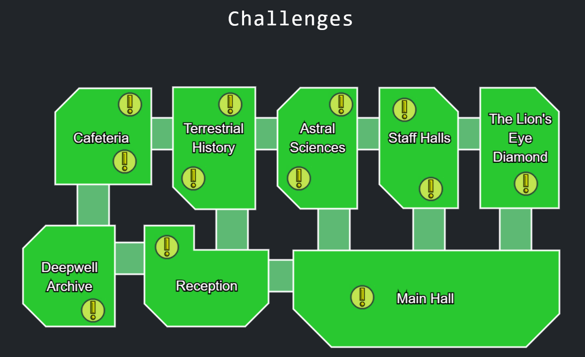
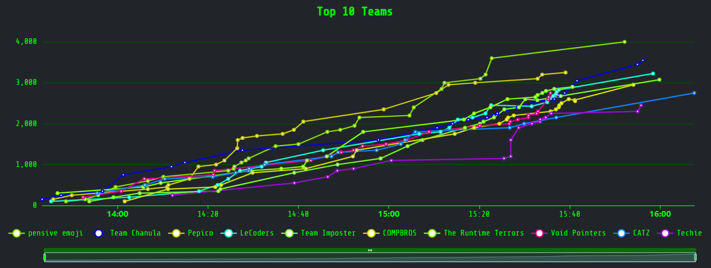

# Amazing Tech Race 2025 (incomplete)

My writeups for ATR 2025 - [go back](../README.md) for more details about the event.

<strong>May 10th, 1:40 PM AWST - May 10th, 4:00 PM AWST</strong>

(Organised by <a href="https://comssa.org.au/">ComSSA</a>)

## Categories

- Easy
   - [100] [A Sky Full of Stars](easy/a_sky_full_of_stars/README.md)
   - [150] [Classification Conundrum](easy/classification_conundrum/README.md)
   - [100] [Message From The Stars](easy/message_from_the_stars/README.md)
   - [100] [Point of Fail](easy/point_of_fail/README.md)
   - [100] [Stay Social](easy/stay_social/README.md)
   - [100] [Timeline of Everything](easy/timeline_of_everything/README.md)

- Medium
   - [300] [Astronomical Appraisal](medium/astronomical_appraisal/README.md)
   - [150] [Chronological Mismanagement](medium/chronological_mismanagement/README.md)
   - [400] [Dental Detective](medium/dental_detective/README.md)
   - [200] [Diet Decoder](medium/diet_decoder/README.md)
   - [350] [Hotwire Hacking](medium/hotwire_hacking/README.md)
   - [350] [Lightspeed Lockpick](medium/lightspeed_lockpick/README.md)
   - [200] [Message From The Stars Part 2](medium/message_from_the_stars_part_2/README.md)
   - [300] [Operation Unfeasible](medium/operation_unfeasible/README.md)
   - [250] [The Deepwell Heist Part I: Invisible Infiltration](medium/the_deepwell_heist_part_i_invisible_infiltration/README.md)
   - [450] [Virtual Fauna](medium/virtual_fauna/README.md)

- Hard
   - [450] [Audit Logs](hard/audit_logs/README.md)
   - [700] [Blinded Scribing](hard/blinded_scribing/README.md)
   - [400] [Scrambled Script](hard/scrambled_script/README.md)
   - [300] [The Deepwell Heist Part II: Expedited Exfiltration](hard/the_deepwell_heist_part_ii_expedited_exfiltration/README.md)
   - [600] [The Great Escape](hard/the_great_escape/README.md)

- Narrative
   - [400] [The Great Treasure Vault](narrative/the_great_treasure_vault/README.md)

## Results

| Place | Team | Bracket | Score |
| --- | --- | --- | --- |
| 1 | pensive emoji | Tier 1 | 4000 |
| 2 | Team Chanula | Tier 1 | 3550 |
| 3 | Pepico | Tier 2 | 3250 |
| 4 | LeCoders | Tier 2 | 3225 |
| 5 | Team Imposter | Tier 2 | 3075 |
| 6 | COMPBROS | Tier 1 | 2950 |
| 7 | The Runtime Terrors | Tier 1 | 2900 |
| 8 | Void Pointers | Tier 2 | 2750 |
| 9 | CATZ | Tier 2 | 2750 |
| 10 | Techie | Tier 2 | 2450 |
| 11 | The@syndicate | Tier 2 | 2350 |
| 12 | papoy | Tier 2 | 2200 |
| 13 | Yo Gurt | Tier 2 | 1650 |
