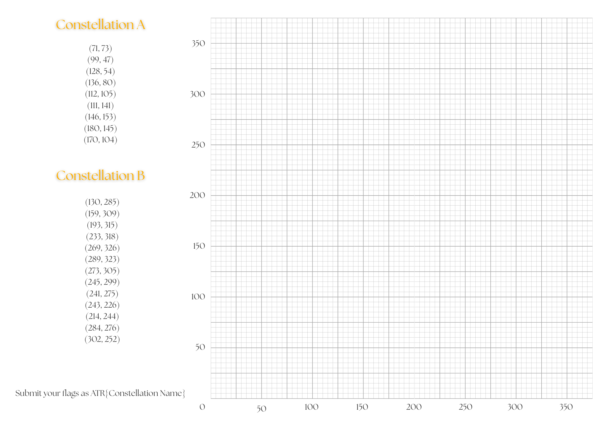
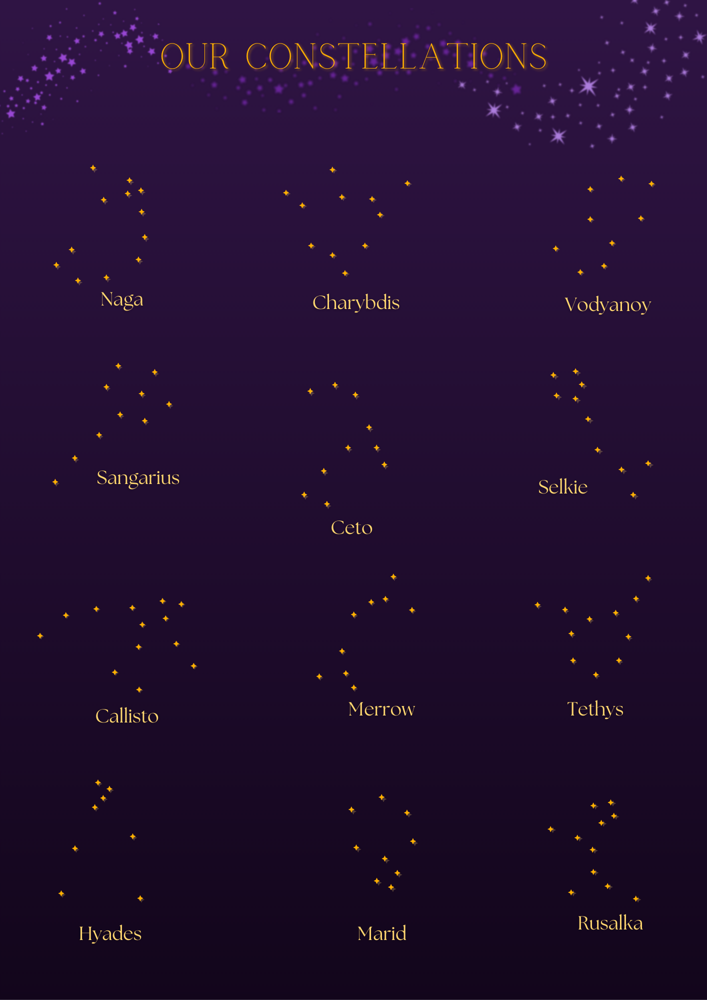
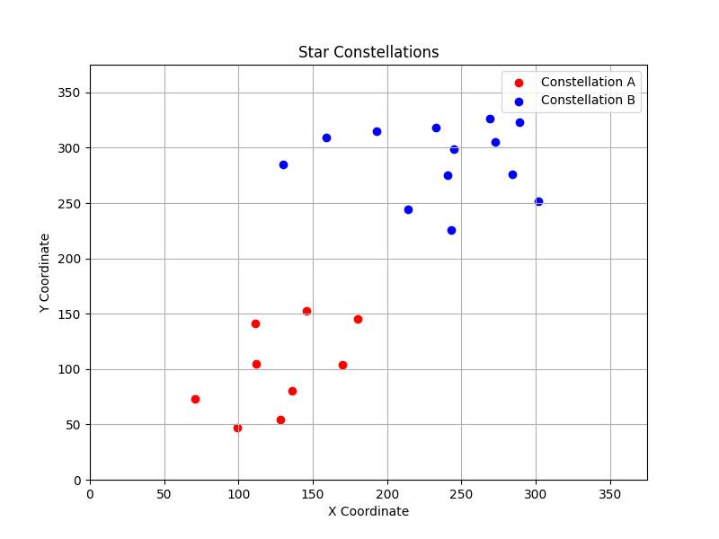

# A Sky Full of Stars

[Back to Home](../../README.md)

## Points

Easy - 200 points

## Description

For thousands of years, humans have looked to the stars and found patterns within them, drawing meaning from what they see. For your crew, the constellations are another potential hiding place for treasure and secrets. Find patterns within the alien stars, and draw meaning from them to get ahead in the race for treasure.

Your main flag is Constellation B. Flag names will be capitalised.

*This activity is in-person, in the Astral Sciences room.*

## Solution

Students will be given a sheet of constellations, graphing paper, and a list of coordinates. They will graph a plot according to the coordinates, and then identify the constellations. The constellation names will be submitted as flags.

Here is the sheet:
<p align="center"></p>

Here are the constellations:
<p align="center"></p>

A helper python script is attached to help with graphing for this writeup.

```python
import matplotlib.pyplot as plt

CONSTELLATION_A = [
  (71, 73),
  (99, 47),
  (128, 54),
  (136, 80),
  (112, 105),
  (111, 141),
  (146, 153),
  (180, 145),
  (170, 104)
]

CONSTELLATION_B = [
  (130, 285),
  (159, 309),
  (193, 315),
  (233, 318),
  (269, 326),
  (289, 323),
  (273, 305),
  (245, 299),
  (241, 275),
  (243, 226),
  (214, 244),
  (284, 276),
  (302, 252)
]

x_coords_a, y_coords_a = zip(*CONSTELLATION_A)
x_coords_b, y_coords_b = zip(*CONSTELLATION_B)

plt.figure(figsize=(8, 6))
plt.scatter(x_coords_a, y_coords_a, color='red', label='Constellation A')
plt.scatter(x_coords_b, y_coords_b, color='blue', label='Constellation B')

plt.title("Star Constellations")
plt.xlabel("X Coordinate")
plt.ylabel("Y Coordinate")
plt.grid(True)
plt.legend()

plt.gca().set_xlim(0, 375)
plt.gca().set_ylim(0, 375)

plt.savefig("star_constellations.png")
```

Here is the resulting graph:

<p align="center"></p>

It's clear that Constellation A is `VODYANOY`, and Constellation B is `CALLISTO`.
Therefore the flags are `ATR{VODYANOY}` and `ATR{CALLISTO}` respectively.
