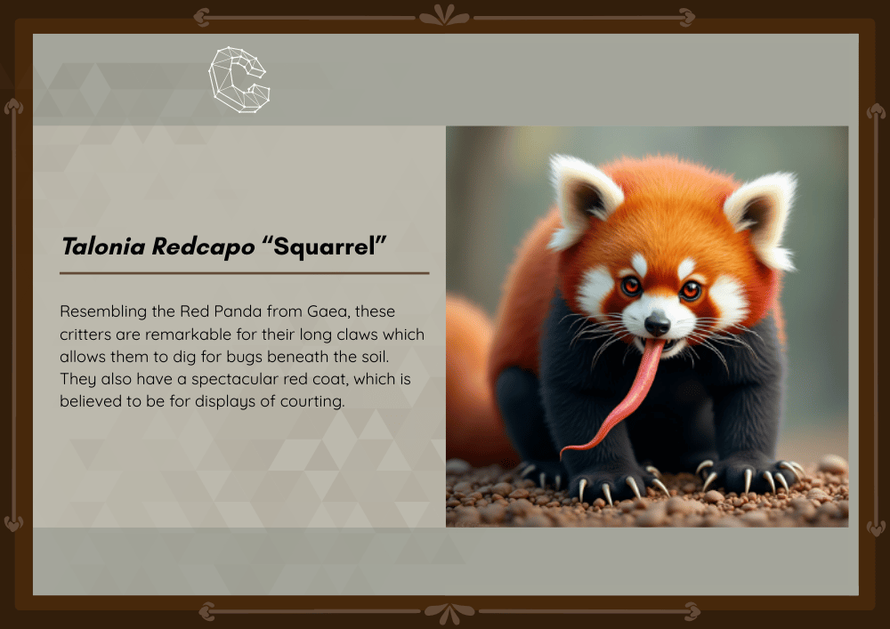
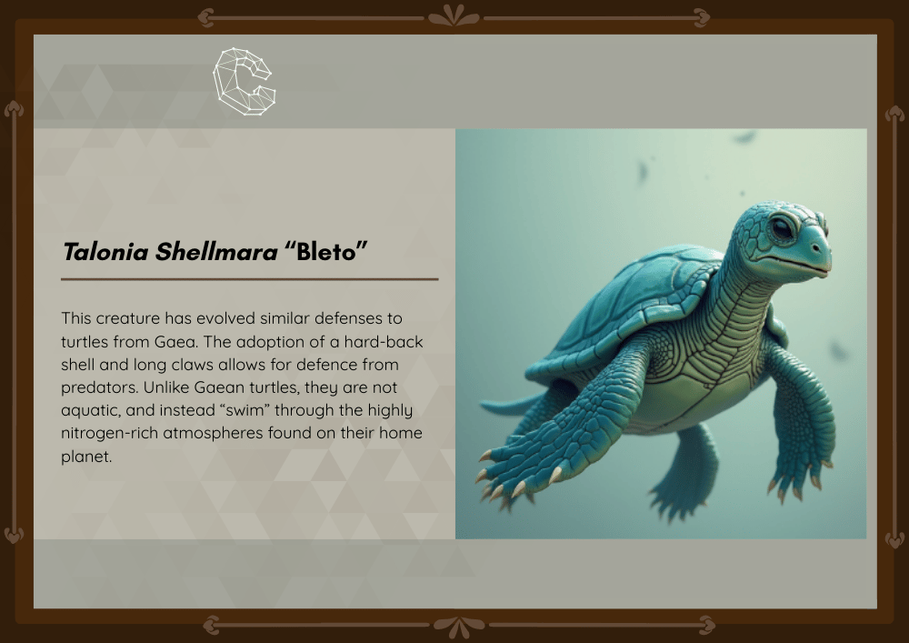
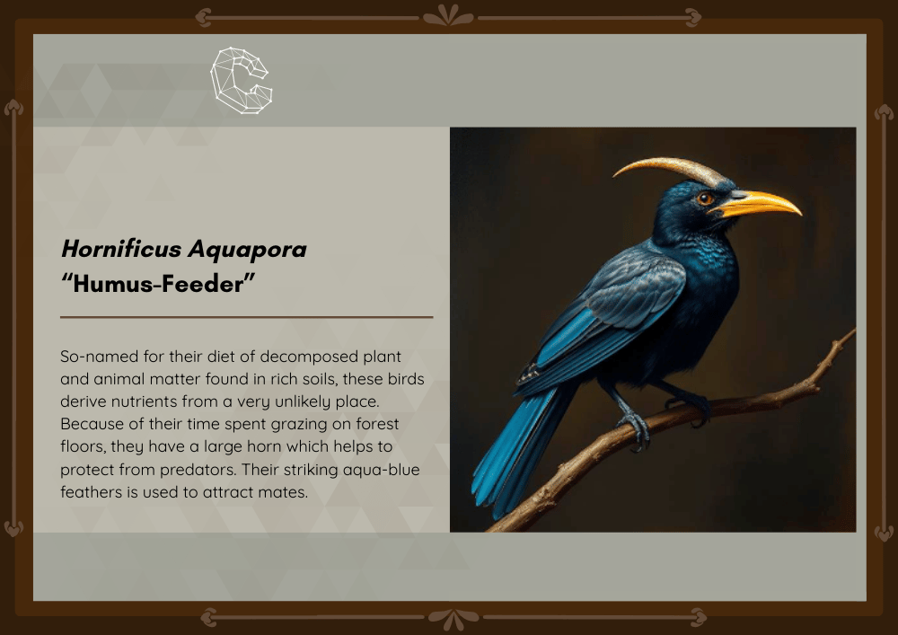
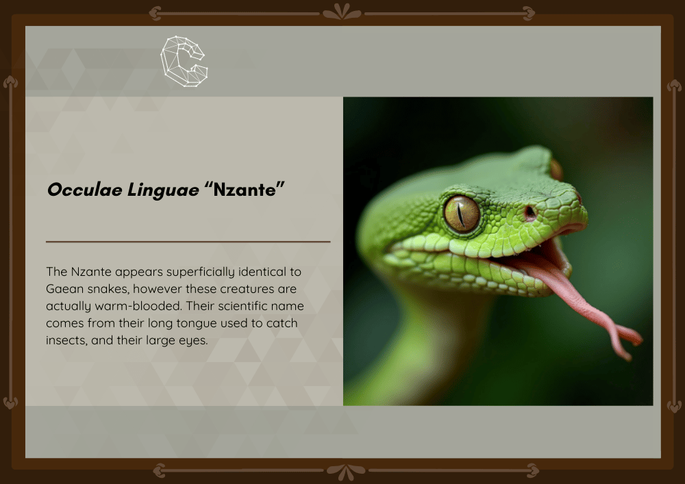
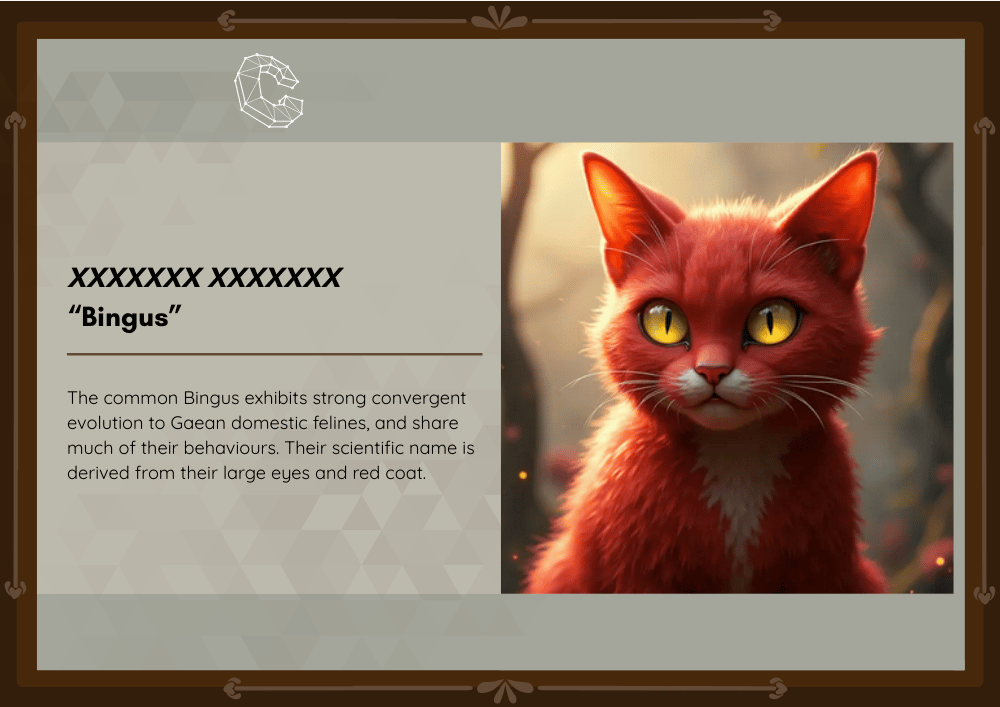

# Classification Conundrum

[Back to Home](../../README.md)

## Points

Easy - 150 points

## Description

The habitats of these animals are identical replications of the planets which they came from. Over the years, evolution has taken place to lead them to look similar to Gaea's nature. Could this convergent evolution be related to how the museum's safe operates?

Your main flag will be the scientific name of the Bingus.

*This activity is in-person, in the Terrestrial History exhibit.*

## Solution

Each of the animals has a description and a scientific name. The posters are displayed as follows:

- Talonia Redcapo "Squarrel"

- Talonia Shellmara "Bleto"

- Hornificus Aquapara "Humus-Feeder" 

- Occulae Linguae "Nzante"

- XXXXXXX XXXXXX "Bingus"

We need to work out the scientific name of the Bingus, using the other animals as clues.

The animal has yellow eyes and red fur which are attributes shared by two other animals: 
- Talonia Redcapo "Squarrel" - red fur
- Occulae Linguae "Nzante" - yellow eyes

Therefore we can assume that the Bingus is a combination of the two animals, giving us **Occulae Redcapo**.

We can format the flag as `ATR{Occulae Redcapo}`.
