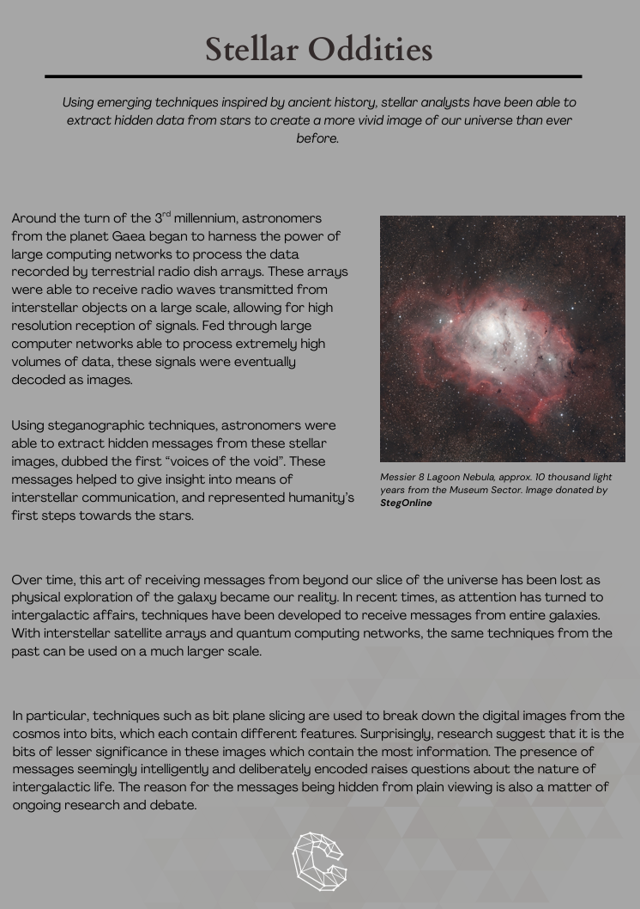
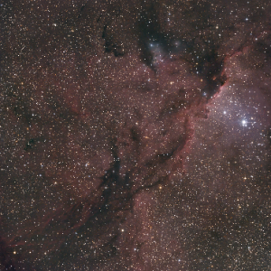
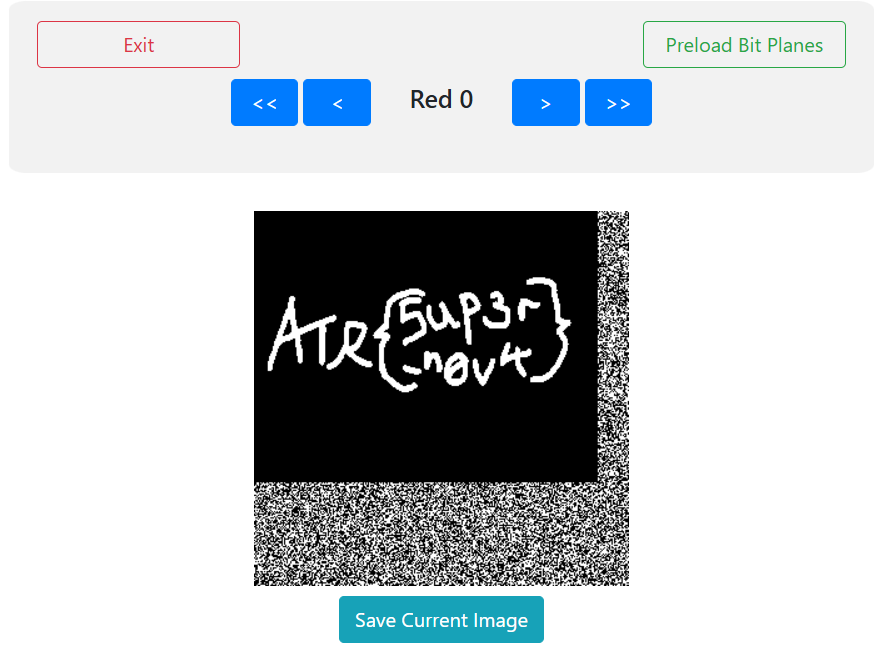

# Message From The Stars

[Back to Home](../../README.md)

## Points

Easy - 100 points

## Description

One of your crew noticed something suspicious in one of the Stellar exhibits. It goes on at length about the presence of hidden messages in stars, which really caught their eye. It’s worth investigating: after all, you can only stand to gain treasure and notoriety. Hidden messages within hidden messages - just how well-hidden is this code?

## Solution

The document provided includes a reference to [StegOnline](https://georgeom.net/StegOnline). Using this tool and using the "browse bit plane" will reveal the flag.

Document:

Provided image:

Solution:

This leads on to part 2, which can be found [here](../../medium/message_from_the_stars_part_2/README.md).