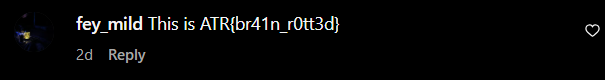

# Stay Social

[Back to Home](../../README.md)

## Points

Easy - 200 points

## Description

Some hidden messages have been found throughout ComSSA's socials. Visit the different pages, see what's going on with ComSSA, and grab some extra points while you're at it.

Your main flag can be found in ComSSA's April Newsletter, with information related to the ATR.

## Solution

There is a main flag worth 100 points, then two subflags each worth 50 points.

### Main Flag

The main flag is hidden in the April newsletter on the ATR Poster page. The newsletter can be found at [this link](https://www.canva.com/design/DAGjYiLvef4/-5qYqO3PiZw1tv_2MgLr7w/view#7) and has the flag of `ATR{y0uv3_g0t_m41l}`.

### Subflag 1

The first subflag has a description of `Check out our Discord announcements for updates and news!`. The most recent announcement in the ComSSA server has the  flag of `ATR{@3v3ry0n3}`.

### Subflag 2

The second subflag has a description of `Check out our Instagram for upcoming events and fun stories!`. The most recent post at the time on the [ComSSA Instagram](https://www.instagram.com/comssacurtin/) has the flag of `ATR{br41n_r0tt3d}` in a comment.

