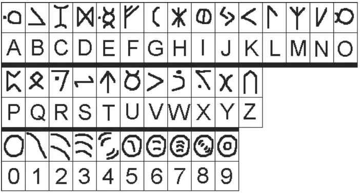

# Blinded Scribing

[Back to Home](../../README.md)

## Points

Hard - 700 points

## Description

Your crew managed to steal a pair of ancient tablets that were locked up tight in a security room, marked not for exhibition. You were nearly caught by security, but managed to escape to the nearby Astral Sciences room, completely dark except for the soft glow of holographic stars above. The box is labelled **LIGHT SENSITIVE**, so you decide not to risk it and keep them inside. Can you decipher the tablets by touch alone, and translate their secrets for your own taking?

Your main flag will be found in the large tablet.

*This activity is in-person, in the Astral Sciences room.*

## Solution

One team member will be designated as allowed to touch the tablets, and they must be blindfolded. Then, the other team members will be given the translation sheet. Team members can freely communicate, but no one person should be able to see both the tablets and translation sheets.

The box contains a long and thin tablet containing only numbers, which decodes to the first flag. It also contains a square tablet, with full alphanumeric text with the flag as part of a short sentence. Participants should be directed to attempt translation of the numbers tablet first.

The main flag is the full excerpt on the tablet, which can have all alphanumeric characters. Successfully translating the tablet will yield the main flag `ATR{4s_f0r3t0ld}`

Teams can also attempt a simpler version for 200 points, with only numbers 0-9. Upon successful translation, the flag will be `ATR{57939624}`.
