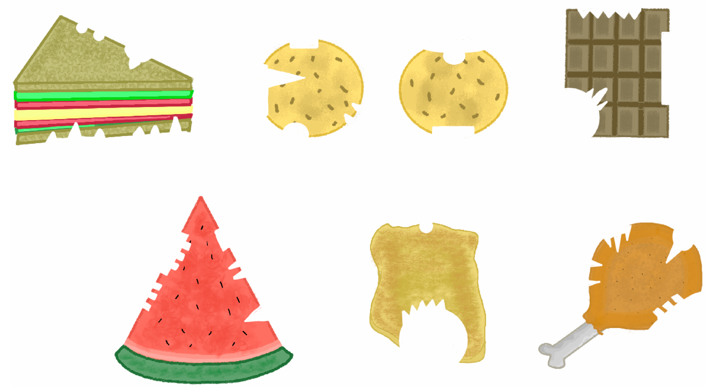

# Dental Detective

[Back to Home](../../README.md)

## Points

Medium - 400 points

## Description

Your crew member disguised as a staff member receives the following message:

*There’s been a rash of food thefts in the cafeteria! Mischievous creatures have gone
rogue and started stealing food items left and right. Things are getting completely out of
hand!*

*The cafeteria staff have gathered leftover food remains as evidence. Meanwhile, the
security team has compiled descriptions of several suspicious individuals and have
collected their details, specifically on their tooth structures.*

*For each piece of food evidence, you MUST:*
*1. Identify the total number of bite marks found.*
*2. Match the bite marks to the suspects based on their unique tooth patterns.*
*3. Count how many times each suspect bit into the food.*
*But beware! The cafeteria staff have also warned that some suspects bit into the same
area more than once which overlapped their marks with previous bites. This means not
all bite marks are clean or exclusive to one creature!*

*Best of Luck!*

Better get to work and earn trust with the staff.

*This activity is in-person, in the Cafeteria.*

## Solution

You are provided with details of each creature as follows:

| **Creature** | **Tooth Structure Description**                                                                    |
|--------------|----------------------------------------------------------------------------------------------------|
| Creature A   | No gaps in their teeth with smoothed out teeth. Very long mouth. Their bites will most likely be an oval shape. |
| Creature B   | Very small creature with a very small mouth. No gaps in teeth. Smoothed out teeth. Their bites will most likely be a very small circle shape. |
| Creature C   | Creature’s B older brother. Same tooth structure as Creature B but slightly bigger.                |
| Creature D   | Creature B and C’s father. Way bigger than creature C.                                             |
| Creature E   | Only has one tooth that’s shaped like a very small triangle.                                       |
| Creature F   | Creature E’s friend. A very small rectangle instead.                                               |
| Creature G   | Creature F’s sister. A small series of square-like teeth.                                          |
| Creature H   | Related to Creature F but not sure how but definitely is. A slightly longer rectangle.             |
| Creature I   | Definitely related to F and H. This one you guessed it, a very long rectangle.                     |
| Creature J   | A small tooth, a big tooth, and another small tooth. Between each tooth there’s a small rectangle. |
| Creature K   | Looks like a rabbit tooth? Just a very long triangle.                                              |
| Creature L   | Also a rabbit tooth. But smaller. Not as small as Creature E.                                      |
| Creature M   | REALLY SIMILAR to Creature J. But without the small rectangle.                                     |
| Creature N   | A series of small triangles. Must really hurt if they bit someone.                                 |

Below are the food items that were bitten into:

Here are the answers:

| **Food Item**       | **Total Bite Marks** | **Suspects (Creatures)**       | **Bites per Suspect**                     |
|---------------------|----------------------|--------------------------------|-------------------------------------------|
| Sandwich            | 8                    | B, C, E, J, L                  | B(2), C(1), E(3), J(1), L(1)              |
| Cookie 1            | 6                    | C, E, F, I, K                  | C(1), E(2), H(1), I(1), K(1)              |
| Cookie 2            | 3                    | A, C, H                        | A(1), C(1), H(1)                          |
| Chocolate Bar       | 4                    | D, I, M, N                     | D(1), I(1), M(1), N(1)                    |
| Watermelon Slice    | 7                    | E, F, G, H, L                  | E(2), F(1), G(2), H(1), L(1)              |
| Chicken Nugget      | 3                    | B, D, N                        | B(1), D(1), N(1)                          |
| Drumstick           | 6                    | C, E, G, J, L                  | C(1), E(2), G(1), J(1), L(1)              |

Upon successfully identifying the creatures/the bite marks the flag of `ATR{d3nt4l_c0v3r3d}` was given to teams from a committee member.
