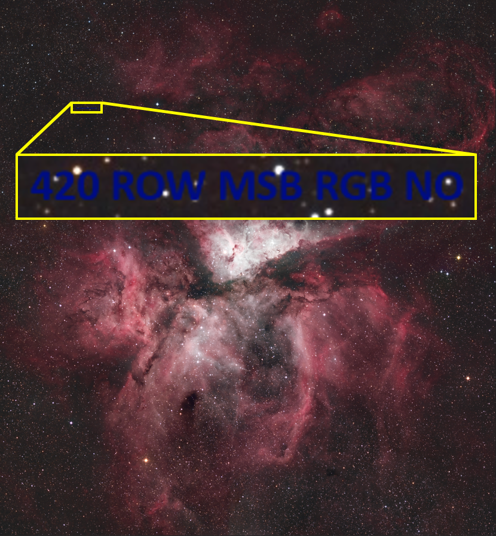
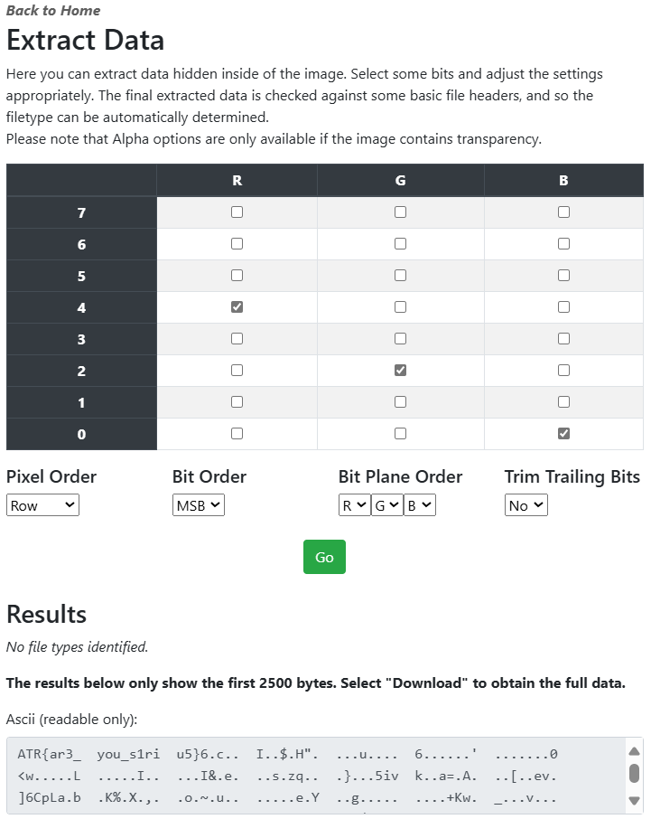

# Message From The Stars

[Back to Home](../../README.md)

## Points

Medium - 200 points

## Description

After some investigation, it seems that there are more hidden messages in the stars, perhaps one of the nebulae may make finding these messages less messier.

## Solution

This follows on from part 1, which can be found [here](../../easy/message_from_the_stars/README.md).

One of the images (photo4.jpeg) provided when zoomed in has some blue text:

This reads "420 ROW MSB RGB NO". Using [StegOnline](https://georgeom.net/StegOnline) again, we can use the "Extract Files/Data" and put in these options on a different image provided (photo2.png):

At the start of the data extracted, we can see the flag `ATR{ar3_you_s1riu5}`.

### Clue for [The Great Treasure Vault](../../narrative/the_great_treasure_vault/README.md)

After successful submission of the main flag, this clue is revealed to the team:

> #11: 5 is the first digit in sequence.
