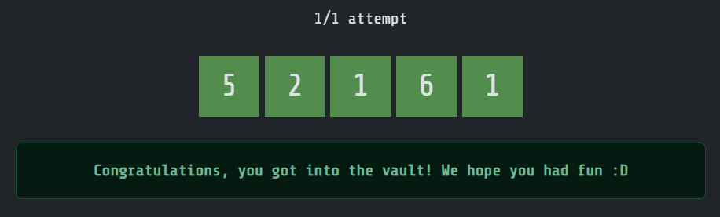
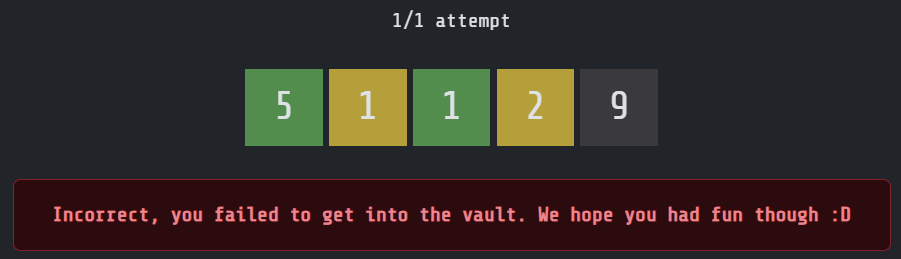

# The Great Treasure Vault

## Points

Narrative - 400 points

## Description

This is it. After hours of searching high and low, through every place you and your crew can think of, you have finally found the Vault. Did you collect enough information to crack the code?

Good luck,

## Solution

### Clues

After successful completion of some challenges, a clue will be made visible to the team. The clues are as follows:

| Clue # | Text                                               | Challenge Prerequisite                                                                |
|--------|----------------------------------------------------|---------------------------------------------------------------------------------------|
| 1      | The total sum of digits in the code is 15.         | [Hotwire Hacking](../../medium/hotwire_hacking/README.md)                             |
| 2      | One digit appears twice. The rest are unique.      | [Lightspeed Lockpick](../../medium/lightspeed_lockpick/README.md)                     |
| 3      | The first digit of the code is odd.                | [Point of Fail](../../easy/point_of_fail/README.md)                                   |
| 4      | Only digits not divisible by 4 appear in the code. | [A Sky Full of Stars](../../easy/a_sky_full_of_stars/README.md)                       |
| 5      | The digits 0 and 9 do not appear in the code.      | [Chronological Mismanagement](../../medium/chronological_mismanagement/README.md)     |
| 6      | The product of the last three digits is 6.         | [Timeline of Everything](../../easy/timeline_of_everything/README.md)                 |
| 7      | There are three odd digits in the code.            | [Diet Decoder](../../medium/diet_decoder/README.md)                                   |
| 8      | The digit 7 does not appear in the code.           | [Operation Unfeasible](../../medium/operation_unfeasible/README.md)                   |
| 9      | 6 is the fourth digit in sequence.                 | [Virtual Fauna](../../medium/virtual_fauna/README.md)                                 |
| 10     | The last digit of the code is odd.                 | [Blinded Scribing](../../hard/blinded_scribing/README.md)                             |
| 11     | 5 is the first digit in sequence.                  | [Message From The Stars Part 2](../../medium/message_from_the_stars_part_2/README.md) |
| 12     | 5 only appears once in sequence.                   | [Astronomical Appraisal](../../medium/astronomical_appraisal/README.md)               |

### Putting it all together

- We know the clue has 5 digits (from the website UI).
- *Clue #1 tells us that the total sum of digits in the code is 15.*
  - We'll keep this in mind for later.
- *Clue #2 tells us that one digit appears twice, and the rest are unique.*
  - This rules out `7,8,9` being in the code twice as `7+7+0+1+2 = 17`
  - As when combined with clue #1, the sum of numbers is 15.
  - So we know that digits `0,1,2,3,4,5,6` can appear twice, and `7,8,9` can only appear once.
- *Clue #3 tells us that the first digit is odd.*
  - We'll keep this in mind for later.
- *Clue #4 tells us that only digits not divisible by 4 appear in the code.*
  - This means that `4,8` cannot be in the code.
- *Clue #5 tells us that 0 and 9 do not appear in the code.*
  - This means that `0,9` cannot be in the code.
  - As a check-in, we know that we can only use `1,2,3,5,6,7`.
  - After ruling out 0, and applying clue #2, only `1,2,3,5` can appear twice.
- *Clue #6 tells us that the product of the last three digits is six.*
  - This means that the last three digits can only be `1,2,3` or `1,1,6` in some order.
- *Clue #7 tells us that there are three odd digits in the code.*
  - We'll keep this in mind for later.
- *Clue #8 tells us that 7 does not appear in the code.*
  - This means that `7` cannot be in the code, leaving us with `1,2,3,5,6`.
- *Clue #9 tells us that 6 is the fourth digit in sequence.*
  - We can lock that in as the fourth digit.
  - Though also combining this with clue #6, we know that the last three digits product is six.
  - Therefore the last three digits must be `1,1,6` in some order.
  - This also means that the duplicate digit must be `1` and all others are unique.
  - Our code is now `?, ?, 1, 6, 1`
  - The other digits can only be `2,3,5` and we know there are three odd digits from clue #7, therefore one of the digits must be `2`, and the other be `3 or 5`.
  - Though we can work out if it is `3 or 5` by adding the digits together.
  - `1+1+6+2 = 10`, therefore the other digit must be `5`.
  - So our code looks like `[5 or 2], [5 or 2], 1, 6, 1`
  - Though clue #3 tells us that the first digit is odd, therefore the first digit must be `5`.
  - So we can solve our code to be `5, 2, 1, 6, 1` as `2` must be the second digit.

The other clues are not required to solve the code, but may be useful if you are missing other clues.

If a team was did not submit this correctly, they would have received an output in a similar style to wordle, with a green square for correct digit in the correct position, a yellow square for a correct digit in the wrong position, and a blank square for a digit that is not in the code.

The challenge only had one attempt, though they could see how close they were to the correct answer with this.

