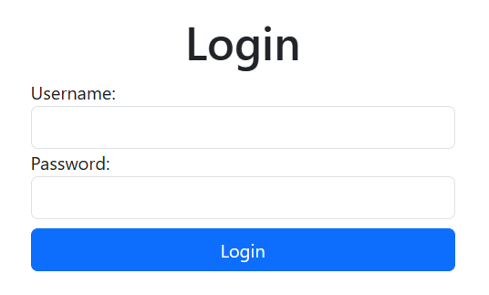
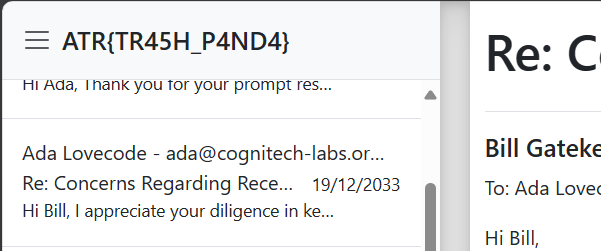

# Client Side Security

[Back to Home](../../README.md)

## Points

Easy - 150 points

## Description

Work out a way to login into Bill's secure web panel.

## Solution

[Source Code](https://github.com/s3ansh33p/atr24_client_side_security)

When first viewing the page, we see a login form with a username and password field.



When we inspect the page, we don't see anything that immediately stands out. The login button has an `onclick` event that calls a function called `login()`. This function isn't defined here, and is likely defined in the `script.js` file.

```html
<!DOCTYPE html>
<html lang="en">
<head>
    <meta charset="UTF-8">
    <meta name="viewport" content="width=device-width, initial-scale=1.0">
    <link href="https://cdn.jsdelivr.net/npm/bootstrap@5.3.3/dist/css/bootstrap.min.css" rel="stylesheet" integrity="sha384-QWTKZyjpPEjISv5WaRU9OFeRpok6YctnYmDr5pNlyT2bRjXh0JMhjY6hW+ALEwIH" crossorigin="anonymous">
    <title>Bill's Secure Web Login</title>
</head>
<body class="vh-100 d-flex justify-content-center align-items-center">
    <div id="div-form" class="d-flex w-100 flex-column align-items-center">
        <h1>Login</h1>
        <form class="w-25" id="loginForm">
            <div class="form-group">
                <label for="username">Username:</label>
                <input type="text" id="username" name="username" class="form-control" required>
            </div>
            <div class="form-group">
                <label for="password">Password:</label>
                <input type="password" id="password" name="password" class="form-control" required>
            </div>
            <button class="w-100 mt-2 btn btn-primary" type="button" onclick="login()">Login</button>
        </form>
    </div>
    <script src="script.js"></script>
    <script src="https://cdn.jsdelivr.net/npm/bootstrap@5.3.3/dist/js/bootstrap.bundle.min.js" integrity="sha384-YvpcrYf0tY3lHB60NNkmXc5s9fDVZLESaAA55NDzOxhy9GkcIdslK1eN7N6jIeHz" crossorigin="anonymous"></script>
</body>
</html>
```

The `script.js` file contains the `login()` function, but has the username and password hardcoded to check on the client side. We can see that the username is `bill` and the password is `NoOneWillEverGuessThisPassword!`.

```javascript
function login() {
    const username = document.getElementById('username').value;
    const password = document.getElementById('password').value;
    if (username === 'bill' && password === 'NoOneWillEverGuessThisPassword!') {
        fetch('/login', {
            method: 'POST',
            headers: {
                'Content-Type': 'application/json',
            },
            body: JSON.stringify({ username, password }),
        })
        .then(response => response.json())
        .then(data => {
            if (data.success) {
                window.location.href = data.redirect;
            } else {
                alert('Login failed. Try again.');
            }
        })
        .catch(error => console.error('Error:', error));
    } else {
        alert('Invalid username or password');
    }
}
```
When we enter the correct username and password, we are redirected to the flag page at `/fc77a530f26298e49d40.html`.
This page contains some narrative information and the flag in the top left of the fake email client.

