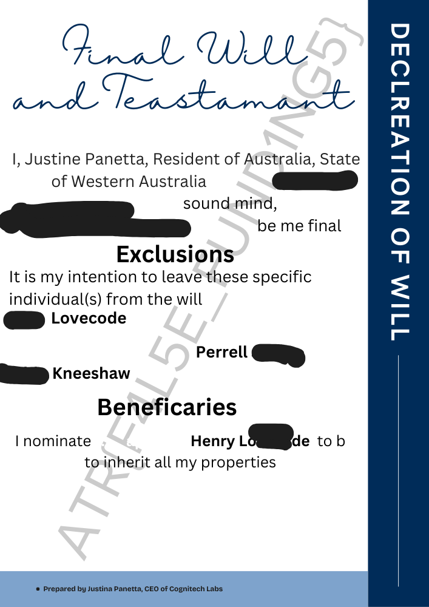

# Document Deconstruction

[Back to Home](../../README.md)

## Points

Easy - 150 points

## Description

Investment final will and testament (subject to change) have been destroyed. Re-assemble the image to figure out the flag and the motivation behind it.

## Solution

The document is cut up into various pieces. The pieces need to be reassembled to form the document which has the flag spanning across it in a watermark. The flag is `ATR{F4L5E_FUND1NG5}`.

